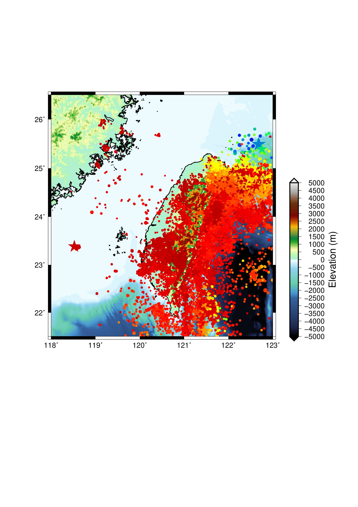

Homework 10
===========

1. 安裝GrowClust，並跑example

執行指令：

```
growclust ssprings.inp 2>&1 | tee ${SOMEWHERE}/growclust.log
```

執行結果：見 logfile_.

.. _logfile: growclust.log

2. 請修改plot_TW_topo_EQs.sh，並完成以下工作
- 將圖大小改為規模/20
- 將規模大於5的地震用星號表示(-Sa)，大小為規模/8

執行指令：見 script_.

.. _script: plot_TW_topo_EQs_HW.bash

結果如 TW_topo_EQs_HW.ps:
附圖(png檔輸出)如下：


